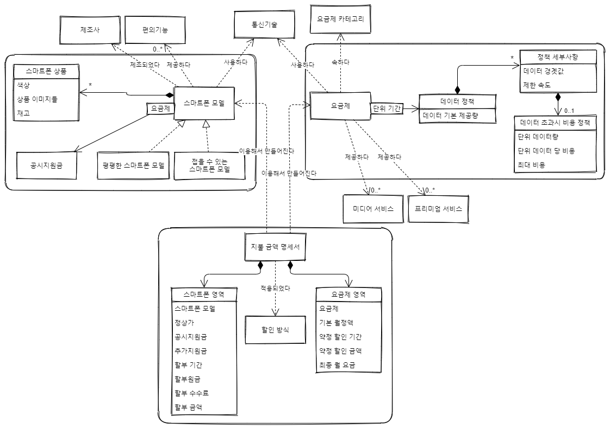

# 이전 프로젝트 리팩터링
## 1. 프로젝트 소개
이전 팀프로젝트에서 제가 맡았던 부분 중 부족한 부분을 리팩터링하고, 추가 기능을 구현하는 프로젝트입니다.
도메인 주도 설계와 단위 테스트라는 책을 읽고 공부하기 위해 만드는 프로젝트입니다.
### 기능
* ```POST /init```: 서버를 처음 시작할 때 모든 데이터 초기화
* ```GET /phones```: 모든 스마트폰 모델 조회
* ```GET /phones/{modelId}```: 스마트폰 모델 아이디로 스마트폰 모델 조회
* ```GET /plans```: 모든 요금제 조회
* ```GET /plans?payment=&minimumMonthlyDataUsage=careAboutSpeedLimit=```: 특정 비용을 지불할 때 한 달간 입력한 데이터 사용량만큼 사용할 수 있는 모든 요금제 조회(속도 제한을 신경쓰는지 선택 가능)
* ```GET /plans/{planId}```: 요금제 아이디로 요금제 조회
* ```GET /plans/{planId}/charge?monthlyDataUsage=```: 특정 요금제의 한 달간 데이터 사용량(MB 단위)에 대한 부과 비용 계산
* ```GET /payments?modelId=planId=installmentPeriod=discountType=```: 스마트폰 모델, 요금제, 할부 기간, 할인 방식에 맞는 지불 금액 명세서 조회
* ```GET /payments?planId=installmentPeriod=discountType=```: 요금제, 할부 기간, 할인 방식에 맞는 모든 스마트폰 모델에 대한 지불 금액 명세서 조회

### 도메인
#### 도메인 모델


\* _모서리가 둥근 사각형은 하나의 애그리게이트를 표현합니다. 모서리가 둥근 사각형 안에 있지 않는 사각형은 모두 애그리게이트 루트입니다._

#### 도메인 규칙
##### 스마트폰
1. 스마트폰 모델은 같은 통신 기술을 사용하는 요금제에 대해서만 공시지원금을 가질 수 있다.

##### 요금제
1. 요금제가 무제한 데이터 정책을 가지고 있을 경우 다른 데이터 정책을 가질 수 없다.
2. 무제한 데이터 정책은 세부사항을 가질 수 없다.
3. 데이터 정책의 첫번째 세부사항의 데이터 경곗값은 0이어야 한다.
4. 데이터 정책의 마지막 세부사항만 속도 제한을 가질 수 있다.

##### 지불 금액 명세서
1. 같은 통신 기술을 사용하는 스마트폰 모델과 요금제에 대해서만 지불 금액 명세서를 생성할 수 있다.

## 2. 기술 스택
* 언어 : Java 17.0.4.1
* 프레임워크 : Spring Boot 2.7.4
* 의존성
    * Spring Web
    * Spring Data Jpa
    * Validation
    * MySql
    * Lombok
* 테스트 : Junit5

## 3. 프로젝트 규칙
도메인 주도 설계 책에 나온 계층형 아키텍처를 따릅니다.
각 주요 모듈마다 Controller, Service, Domain, Repository 패키지가 있습니다.
* **Controller** : 인터페이스를 정의하고 사용자의 입력값을 검사하며 Service 계층에서 받은 값을 반환하는 역할을 합니다.
* **Service** : 소프트웨어가 수행할 작업을 정의하고 도메인 객체를 이용해 문제를 해결합니다. 도메인 객체가 필요하다면 생성하거나 Repository 계층에서 받을 수 있습니다.
* **Domain** : 업무 개념과 업무 상황에 관한 정보, 업무 규칙을 표현하는 일을 책임집니다. 업무 상황을 반영하는 상태를 제어하고 사용하며, 상태 저장은 Repository 계층에서 합니다.
* **Repository** : 도메인 객체를 데이터베이스에 저장 및 수정하거나, 데이터베이스의 데이터를 불러와 도메인 객체로 변환하는 일을 합니다.

## 4. 프로젝트 디렉터리 구조
```
main
  ├─java.com.qwe910205.plusdotcom
  │  ├─common                         -> 공통 요소 모듈
  │  │  ├─exception                   -> 예외 처리를 위한 패키지
  │  │  │  └─controller               -> @RestControllerAdvice가 있는 패키지
  │  │  └─utility                     -> 유틸리티 객체가 있는 패키지
  │  │
  │  ├─datainit                       -> 데이터 초기화 모듈
  │  │  ├─controller
  │  │  └─service
  │  │      ├─dto 
  │  │      └─initializer             -> 특정 데이터를 초기화하는 컴포넌트가 있는 패키지
  │  │
  │  ├─payment                        -> 지불 금액 관련 모듈
  │  │  ├─controller
  │  │  ├─domain  
  │  │  │  ├─factory                  -> 팩토리 패턴 객체가 있는 패키지
  │  │  │  └─wrapper                  -> 원시값을 포장해 값의 무결성을 보장하는 책임을 가진 객체가 있는 패키지
  │  │  └─service
  │  │      └─dto
  │  │
  │  ├─phone                          -> 스마트폰 관련 모듈
  │  │  ├─controller
  │  │  ├─domain
  │  │  │  ├─factory
  │  │  │  └─wrapper
  │  │  ├─repository
  │  │  └─service
  │  │      └─dto
  │  │
  │  └─plan                           -> 요금제 관련 모듈
  │      ├─controller
  │      ├─domain
  │      │  ├─factory
  │      │  └─wrapper
  │      ├─repository
  │      └─service
  │          └─dto
  └─resources
      └─data                          -> 초기화할 데이터가 있는 패키지
```